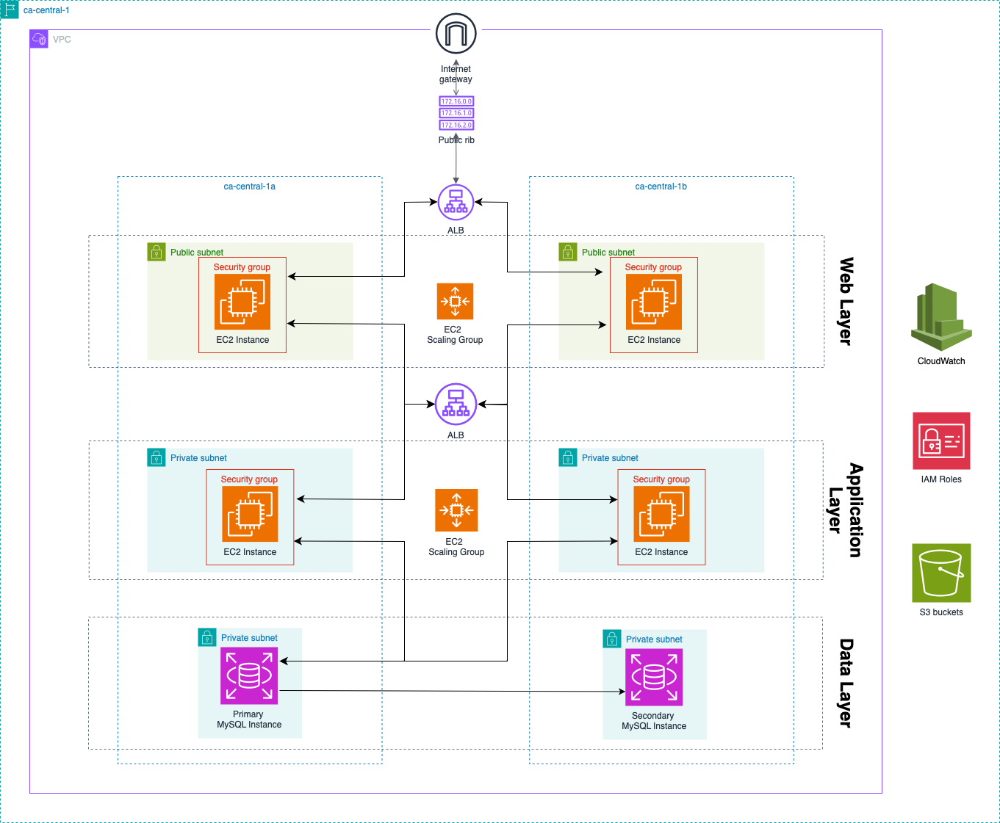

# Capstone Project Solution

## Scenario

You have a web application that accepts requests from the internet. Clients can send requests to query for data. When a request comes in, the web application queries a MySQL database and returns the data to the client.

## Instructions

Design a three-tier architecture that follows AWS best practices by using services such as Amazon Virtual Private Cloud (Amazon VPC), Amazon Elastic Compute Cloud (Amazon EC2), Amazon Relational Database Service (Amazon RDS) with high availability, and Elastic Load Balancing (ELB). Create an architecture diagram that lays out your design, including the networking layer, compute layer, database layer, and anything else that’s needed to accurately depict the architecture. Write a few paragraphs that explain why you chose the AWS services that you used and how they would support the solution for the given scenario. Your explanation must describe how traffic flows through the different AWS components—from the client to the backend database, and back to the client.

## Solution

### Networking

We have a VPC in a region that contains 2 public and 4 private subnets spread across 2 availability zones (AZs) for high availability. We also have an internet gateway attached to the VPC to allow traffic from the internet to flow into the VPC. Finally, we have a custom route table that will take care of routing the internet traffic towards our 2 public subnets with the help of the application load balancer.

### Compute

At the web and application layers, we have at least 2 EC2 instances for each layer spread across 2 different AZs for high availability and fault tolerance. The EC2 instances will be scaled horizontally with the help of the EC2 Scaling Group to handle high traffic periods.

EC2 instances at the application layer are launched within private subnets so we can limit the traffic flowing through them.

## Storage

At the data layer, we have 2 MySQL instances, one primary and one secondary, deployed for fault tolerance purposes. The 2 MySQL instances are deployed using the AWS RDS service to manage the underlying infrastructures.

We also have S3 buckets to back up our database instances and save media files for our application.

## Monitoring

We use AWS CloudWatch to monitor the state of our EC2 and MySQL instances and receive alarms if there is anything wrong with them.

Note: Each EC2 instance is assigned an IAM Role to be able to access data in the database and the storage buckets.

